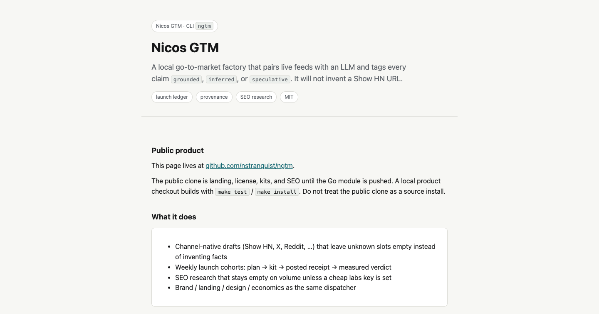

# Nicos GTM (`ngtm`)

Public name: **Nicos GTM**. Short name / CLI: **ngtm**.

A local go-to-market toolkit. It pairs live data feeds with an LLM and tags
every claim `grounded` / `inferred` / `speculative`. Claims without evidence
are rejected. Placement records must be real public URLs.

**Public product:** https://github.com/nstranquist/ngtm  
**Landing:** [`docs/human/index.html`](docs/human/index.html) (same page as [`docs/index.html`](docs/index.html))

This checkout is the product Go module (`github.com/nstranquist/ngtm`).
Requires Go 1.26 or newer. `make test` and `make install` run against this
tree. A public clone is a source install:

```sh
git clone https://github.com/nstranquist/ngtm.git
cd ngtm
go test ./...
make install
```

There is no `replace` pointing at `nicos-tools`. Design preview uses the
public `github.com/nstranquist/snapref` module.

Open `docs/human/index.html` in a browser for the landing page.

## Showcase



The landing page is the same file as `docs/human/index.html`. Extra shots
go in [screenshots/](screenshots/).

## What the CLI covers (when installed)

```sh
ngtm social <product> --pitch "…" --channels show-hn,x,reddit
ngtm launch plan <product> --week 2026-W33
ngtm launch kit <product> --pitch "…" --channels show-hn
ngtm launch open <product> --channel show-hn --json
ngtm --json seo research <product> --config docs/seo-project.yaml
ngtm feeds doctor
```

`--json` and `--offline` may lead the verb or follow it.
`--offline` is rejected on verbs that have no hermetic path.
`seo measure --offline` requires `--fixture`.

MCP (`ngtm mcp`) is analysis and read-only launch. Ledger writes stay on the CLI.

## Build

```sh
make test
make install
```

## License

MIT. See [LICENSE](LICENSE).
